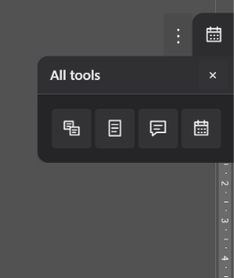
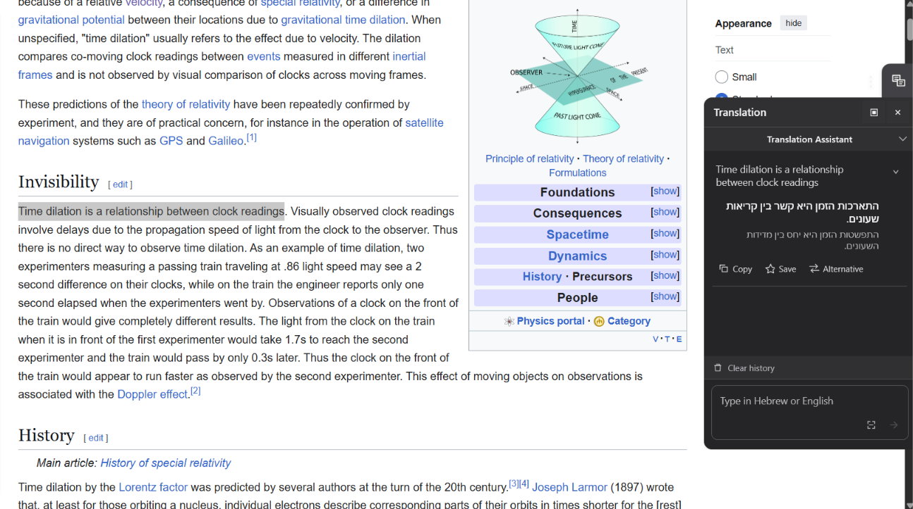
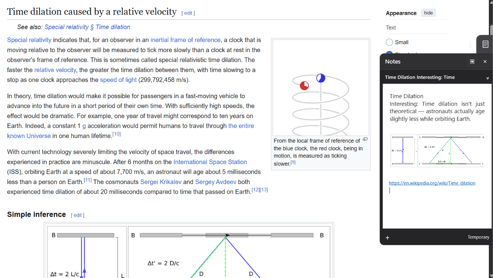
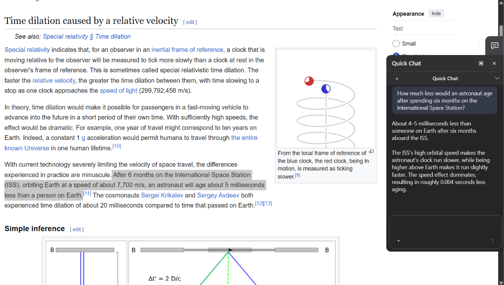
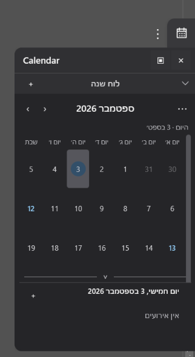

# FloatingTools

A lightweight Windows desktop productivity toolbar for translation, notes, AI chat, and calendar — floating above whatever you are working in.

## Overview

FloatingTools is a Windows desktop application built with C# / .NET / WPF. It runs as a small, always-on-top floating toolbar that opens focused tool panels without requiring you to switch applications or windows. It bundles four tools:

- **Translation** — Hebrew ↔ English translation with history, saved/frequent words, and on-screen text capture
- **Notes** — block-based notes with text, links, and images
- **Quick Chat** — an OpenAI-backed chat panel with streaming responses and image attachments
- **Calendar** — a Hebrew/English calendar with holidays, search, and a day view

The toolbar stays on top of whatever you are working in, and the **All tools** panel gives one-click access to all four tools:



All application data is stored locally. AI features (Translation and Quick Chat) require your own OpenAI API key.

## Features

### Translation

Translate text without leaving the application you are reading. Type or paste
into the panel — or capture text straight off the screen with OCR — and the
translation appears in the feed, where each entry offers **Copy**, **Save**, and
**Alternative** (a second phrasing of the same translation).



- Hebrew ↔ English translation, powered by the OpenAI API
- Translation history
- Saved words and frequent words
- Alternative translation suggestions
- Extract Text from Screen (local OCR capture, see [Screen OCR](#screen-ocr))
- RTL/LTR-aware text presentation

### Notes

Keep notes beside your work. A note is built from blocks, so it can mix written
text, pasted images, and saved links in one place.



- Block-based notes composed of text, links, and images
- Local persistence
- In-place editing, selection, and undo behavior

### Quick Chat

A lightweight AI conversation in the panel, for quick questions that come up
while you work — without switching to a browser or leaving your workspace.



- OpenAI-backed chat with streaming responses
- Image attachments
- Selectable message text
- RTL/LTR-aware paragraph rendering
- Local conversation persistence

### Calendar

Month and Week views with Hebrew or English date presentation. Selecting a day
opens the Day Panel underneath the grid, where that day's events can be viewed
and added.



- Month and Week views
- Events with search
- Hebrew and English date presentation
- Jewish holidays
- Day Panel for a focused view of a single day
- Local persistence

### Application

- Floating toolbar and panel windows, always on top
- Dark, Light, and System themes, following the Windows theme live
- Local shortcuts:
  - `Ctrl+1` – `Ctrl+4` — switch tools
  - `Ctrl+F` — focus search in Translation, Notes, and Calendar (not currently supported in Quick Chat)
- Global shortcuts, registered system-wide when available:
  - `Ctrl+Alt+H` — Show/Hide
  - `Ctrl+Alt+T` — Extract Text from Screen

  Global shortcut registration can fail if another running application already
  owns the same key combination; if that happens, the affected shortcut is
  simply unavailable rather than causing an error.
- Local-first storage — no custom server or cloud sync
- API key stored locally via Windows DPAPI
- No telemetry

## Tech stack

- C# / .NET 10 (`net10.0-windows`)
- WPF
- [CommunityToolkit.Mvvm](https://learn.microsoft.com/en-us/dotnet/communitytoolkit/mvvm/) 8.4.0
- OpenAI API (accessed directly over HTTP, no third-party SDK)
- [TesseractOCR](https://www.nuget.org/packages/TesseractOCR) 5.5.2 (local OCR)
- [DocumentFormat.OpenXml](https://github.com/dotnet/Open-XML-SDK) 3.5.1
- [PDFsharp-WPF](https://www.nuget.org/packages/PDFsharp-WPF) 6.2.4
- [xUnit](https://xunit.net/) 2.9.3

## Architecture highlights

- **MVVM-oriented** architecture, using `CommunityToolkit.Mvvm` for observable state and commands, with focused WPF code-behind for window/input interactions (drag, panel sizing, search-command routing) where that's a better fit than forcing it into a view model
- Two coordinated top-level windows — a fixed-size `ToolbarWindow` and a `PanelWindow` that supports compact Standard/Large panel sizes — synchronized by a single `WindowCoordinator`
- A shared UI layer (`SharedUi`) of reusable styles and components used across all four tools
- A semantic Dark/Light/System theme-token system used throughout most of the UI
- Local-first persistence: application state is stored as JSON under `%LocalAppData%\FloatingTools`
- API keys are encrypted at rest using Windows DPAPI, never stored in plain text
- Service interfaces (`ILocalOcrService`, credential stores, persistence stores, etc.) are abstracted for testability
- Windows global hotkeys via `RegisterHotKey`, independent of application focus
- RTL/LTR-aware text and layout handling across Translation, Quick Chat, and Calendar

## Installation

### Recommended: download a release

1. Download the latest [GitHub Release](../../releases) asset, `FloatingTools-v1.0.0-win-x64.zip`.
2. Extract the ZIP to any folder.
3. Run `FloatingTools.App.exe`.

Notes:

- Windows x64 only.
- The release is self-contained — it bundles its own .NET runtime, so no separate .NET installation is required.
- The executable is unsigned, so Windows SmartScreen may show a warning on first run. Choose "More info" → "Run anyway" to proceed.

### Build from source

Requires the .NET 10 SDK.

```powershell
dotnet restore
dotnet build FloatingTools.sln -c Release
dotnet run --project src/FloatingTools.App -c Release
```

To run the test suite:

```powershell
dotnet test FloatingTools.sln -c Release
```

## AI features and API key

Translation and Quick Chat call the OpenAI API and require your own OpenAI API key. Every other tool (Notes, Calendar, screen OCR) works fully without one.

- Add your key from the application's Settings panel ("Add API Key"). It is encrypted locally using Windows DPAPI — never stored in plain text, never committed to source, and never bundled with the application.
- Alternatively, when building and running from source, you can set the `OPENAI_API_KEY` environment variable (and optionally `FLOATINGTOOLS_OPENAI_MODEL` to override the default model) instead of using the Settings panel.
- No API key ships with FloatingTools. You must supply your own.

## Privacy

- Notes, Calendar, Quick Chat history, and application settings are stored **locally only**, under `%LocalAppData%\FloatingTools`.
- There is no custom server or cloud sync — FloatingTools does not operate any backend of its own.
- When you use Translation or Quick Chat, the relevant request content (the text you're translating, or your chat messages/images) is sent directly to the OpenAI API using your own key.
- There is no telemetry or usage-tracking system in the application.

## Screen OCR

Extract Text from Screen is an action rather than a separate tool. Trigger it with
`Ctrl+Alt+T` or the capture button in the Translation panel, select a region of the
screen, and the recognized text is placed into the Translation input — ready to
translate, edit, or copy from there.

Recognition runs locally using [Tesseract](https://github.com/tesseract-ocr/tesseract)
via the TesseractOCR package; no image or text is sent anywhere for OCR. Only the
English trained-data model is bundled in v1.0, so accuracy is best on English text.

## Testing

The project is covered by an automated xUnit suite spanning:

- core services and view models
- local JSON persistence, including document migrations
- WPF behaviors and view contracts, exercised against real windows
- RTL/LTR text-direction and Dark/Light theme regressions
- release-critical integration behavior, including build-configuration-specific code paths

The suite runs in both the Debug and Release configurations:

```powershell
dotnet test FloatingTools.sln -c Release
```

## Limitations

- Windows only.
- Unsigned executable — Windows SmartScreen will warn on first run.
- OCR is currently English-only.
- AI features (Translation, Quick Chat) require your own OpenAI API key.
- Translation currently focuses on Hebrew ↔ English.

## License

FloatingTools is licensed under the [MIT License](LICENSE).

Third-party notices and license texts for bundled dependencies are included in [`THIRD-PARTY-NOTICES.md`](THIRD-PARTY-NOTICES.md) and the [`licenses/`](licenses/) folder.
